# **Assignment I: Sunrise Supermarket**

# **Business Scenario**

Sunrise’s management requested a database application that can track their customers, orders, and sales. 

# **Database Used**

I used Oracle 21c to create the database for Sunrise Supermarket.

# **Database Schema**

## ***Relational Schema***
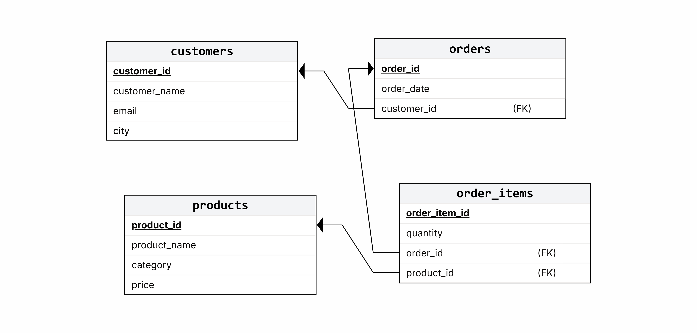 
## ***SQL Schema***
```sql
CREATE TABLE customers (
  customer_id NUMBER PRIMARY KEY,
  customer_name VARCHAR2(100),
  email VARCHAR2(100),
  city VARCHAR2(50)
);

CREATE TABLE products (
  product_id NUMBER PRIMARY KEY,
  product_name VARCHAR2(100),
  category VARCHAR2(50),
  price NUMBER(10,2)
);

CREATE TABLE orders (
  order_id NUMBER PRIMARY KEY,
  customer_id NUMBER REFERENCES customers(customer_id),
  order_date DATE
);

CREATE TABLE order_items (
  order_item_id NUMBER PRIMARY KEY,
  order_id NUMBER REFERENCES orders(order_id),
  product_id NUMBER REFERENCES products(product_id),
  quantity NUMBER
);
```
# **Creating Database**
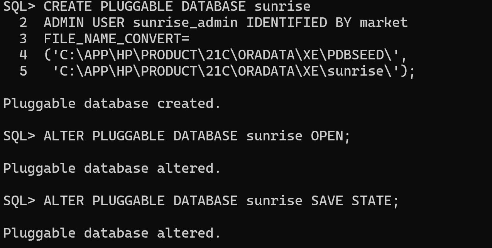 

* Change container to sunrise PDB and grant all privileges to sunrise_admin

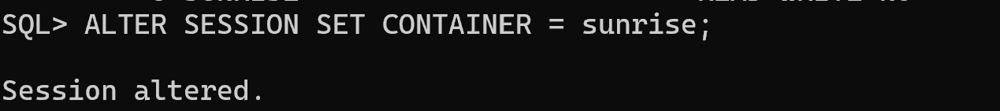
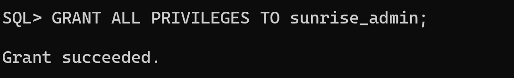

* Login as sunrise\_admin

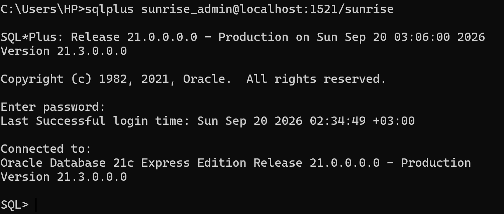

# **Inserting Data**

I populated the four tables using the import function of SQL Developer. 

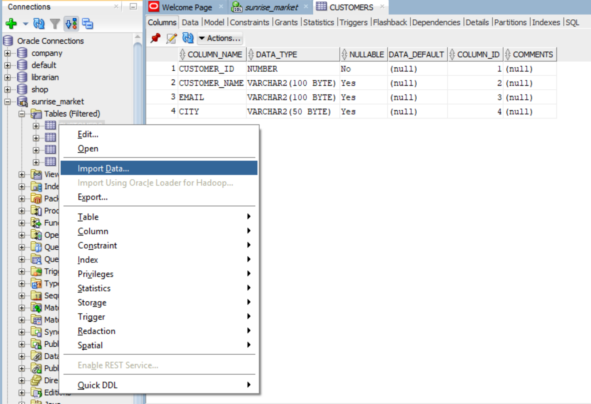

**Populated Tables**

***Customers Table***

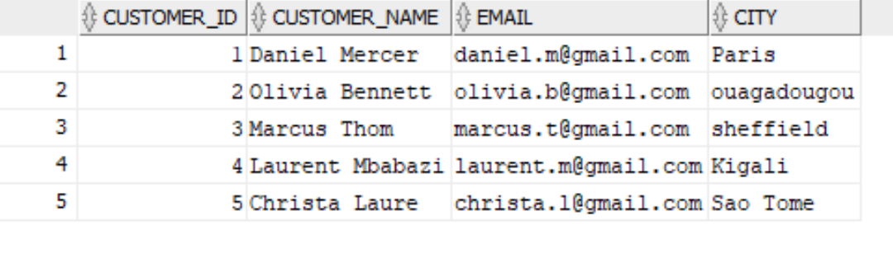

***Products Table***

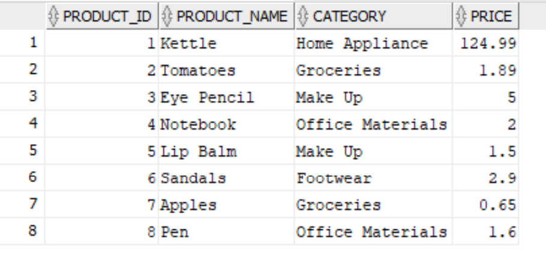

***Orders Table***

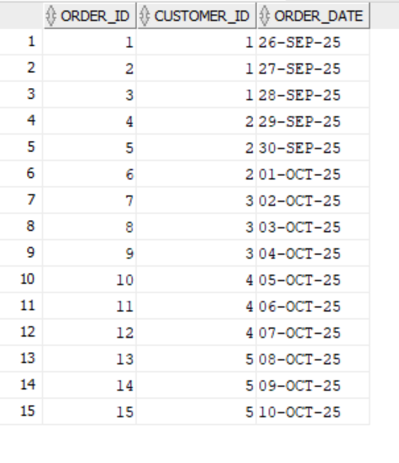

***Order Items Table***

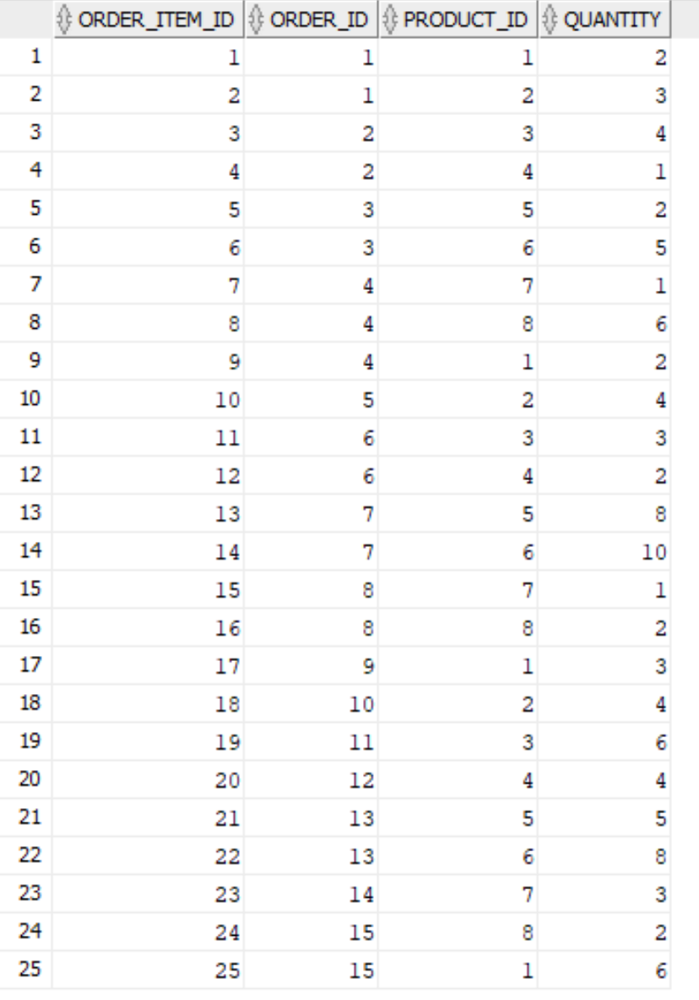

# **Querries**

## ***Join Querries***

**Query 1:** List every order with the customer's name, city, and order date  

```sql
SELECT o.order_id, c.customer_name, c.city, o.order_date
FROM orders o INNER JOIN customers c
ON o.customer_id = c.customer_id;
```
**Output:** 

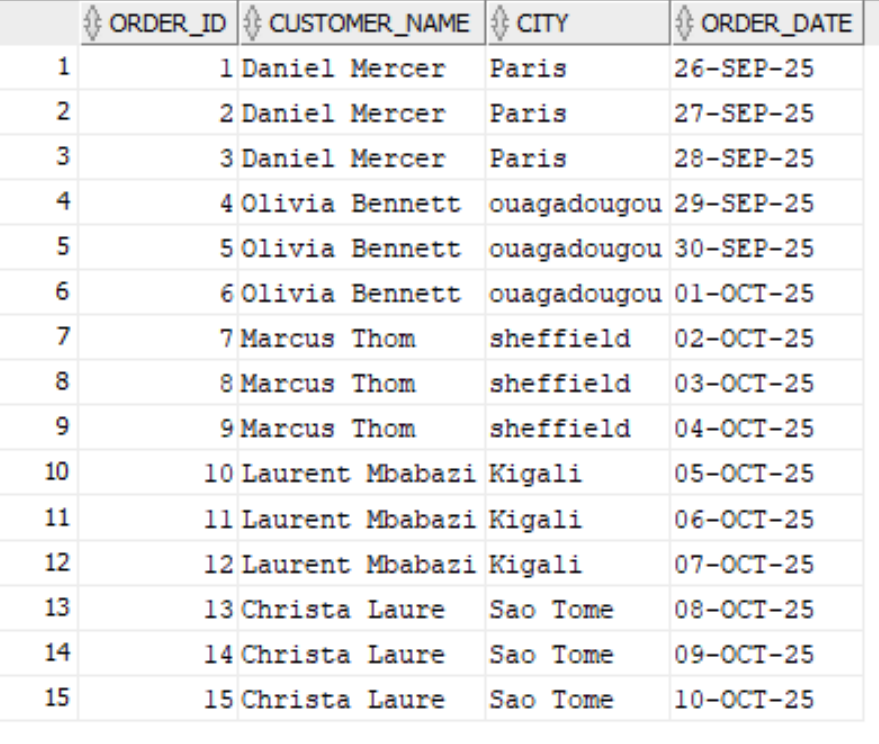

**Business Interpretation:** This query shows where customers are making orders. It can be useful to management to know where to start targeted geographical marketing campagins.

**Query 2:** List every order item with product name, category, price, and quantity 

```sql
SELECT oi.order_item_id, p.product_name, p.category, p.price, oi.quantity
FROM order_items oi JOIN products p
ON oi.product_id = p.product_id;
```
**Output:** 

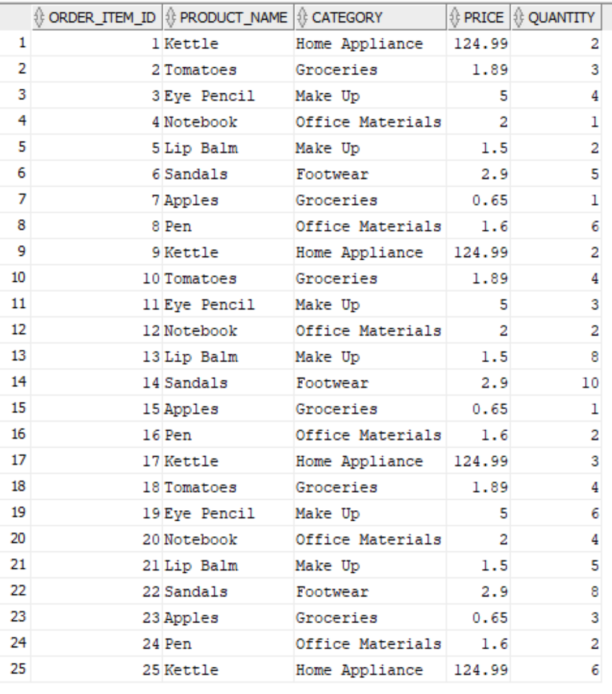

**Query 3:** List all customers and their orders where they exist, including customers with no orders 

```sql
SELECT c.customer_name, o.order_id, o.order_date
-- use left join to include even customers without orders
FROM customers c LEFT JOIN orders o
ON o.customer_id = c.customer_id;
```

**Output:** 

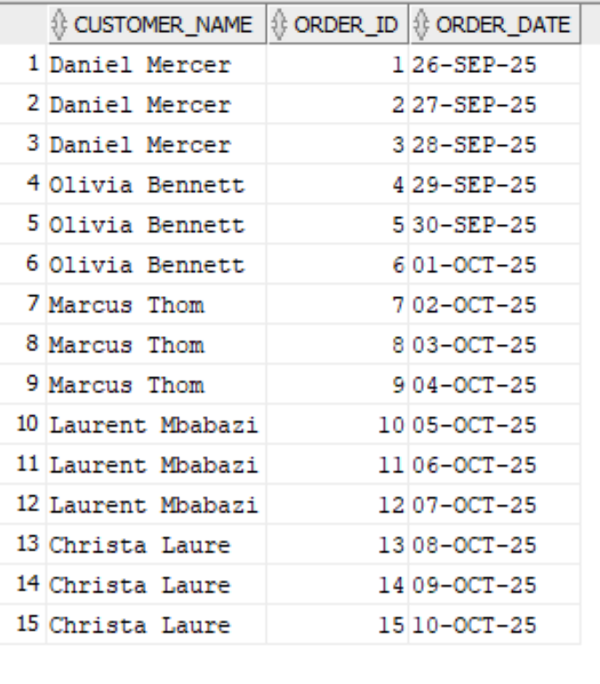

## ***CTE query***

**Task:** Calculate each customer's total spend (quantity x price) and return customers above average spend. 

```sql
WITH cte_customer_spend AS (
    -- compute customer's totals
    SELECT c.customer_name, SUM(oi.quantity * p.price) AS "Total Spend"
    FROM customers c, orders o, products p, order_items oi
    WHERE c.customer_id = o.customer_id AND oi.order_id  = o.order_id
    AND oi.product_id = p.product_id
    GROUP BY c.customer_id, c.customer_name
)
-- display only customers above average spend
SELECT *
FROM cte_customer_spend
WHERE "Total Spend" > (
    SELECT AVG("Total Spend") FROM cte_customer_spend
);
```
**Output:** 

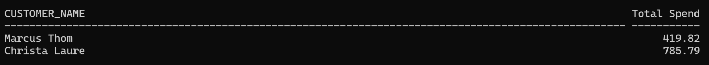

**Business Interpretation:** This query shows management which customers are willing to spend more money on their products.

## ***Window-function queries***

**Query:** Rank customers by total amount spent, highest first. 

```sql
WITH cte_customer_spend AS (
    -- compute customer's totals using all tables
    SELECT c.customer_name, SUM(oi.quantity * p.price) AS "Total Spend"
    FROM customers c, orders o, products p, order_items oi
    WHERE c.customer_id = o.customer_id AND oi.order_id  = o.order_id
    AND oi.product_id = p.product_id
    GROUP BY c.customer_id, c.customer_name
)
SELECT customer_name, "Total Spend",
-- define the window function
RANK() OVER(ORDER BY "Total Spend" DESC) as "Rank"
FROM cte_customer_spend;
```

**Output:**

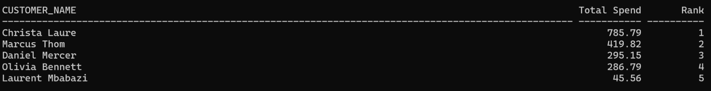

**Business Interpretation:** This query shows management which customers are most active for targeted marketing.

**Query:** Number each customer's orders in the order placed. 

```sql
SELECT c.customer_name, o.order_id, o.order_date,
-- assign a row number to each customer based on the earlier order_date
ROW_NUMBER() OVER(ORDER BY o.order_date ASC) as "Order Placement"
FROM customers c INNER JOIN orders o
ON o.customer_id = c.customer_id;
```
**Output:** 

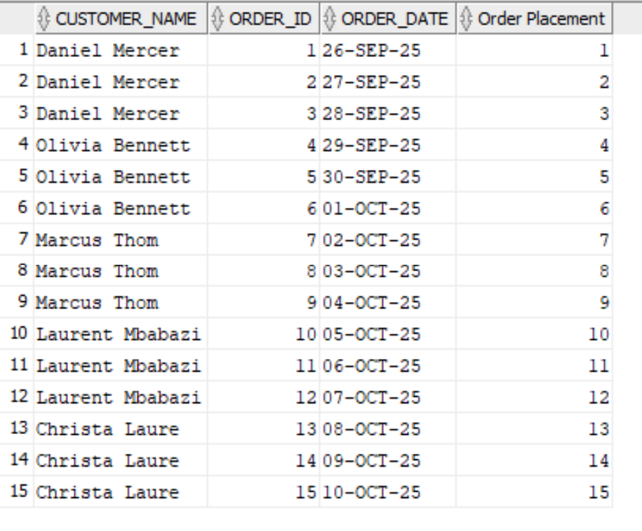

**Query:** Show a running total of revenue over time, ordered by order date. 

**Algorithm:** For every order:

&emsp;SUM the (price \* quantity) of the order\_items as Revenue

&emsp;Order by order date ASC

&emsp;Show Order\_id, Order\_Date, Revenue

```sql
SELECT o.order_id, o.order_date,
-- partition by to group by order,
SUM(p.price * oi.quantity) OVER(PARTITION BY o.order_id ORDER BY o.order_date ASC) as "Revenue"
FROM orders o, products p, order_items oi
WHERE oi.order_id = o.order_id AND oi.product_id = p.product_id;
```

**Output:** 

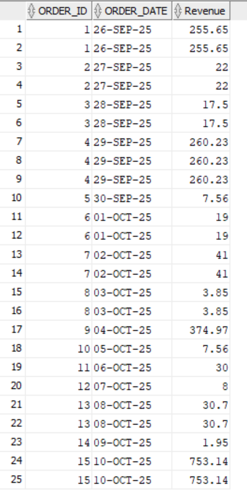

**Business Interpretation:** This query informs the business of the amount of revenue they make with each order over time.

**Query:** For each customer with more than one order, show the days between the current and previous order. 

```sql
SELECT DISTINCT c.customer_name,
-- calculate the days between current and previous order date
(o.order_date - LAG(o.order_date) OVER(ORDER BY o.order_date ASC)) as "Days Btwn Current and Previous Order"
FROM customers c INNER JOIN orders o ON o.customer_id = c.customer_id
WHERE c.customer_id IN (
    -- find customers who have more than 1 order
    SELECT c.customer_id
    FROM customers c, orders o
    WHERE o.customer_id = c.customer_id
    GROUP BY c.customer_id
    HAVING COUNT(o.order_id) > 1
);
```

**Output:** 

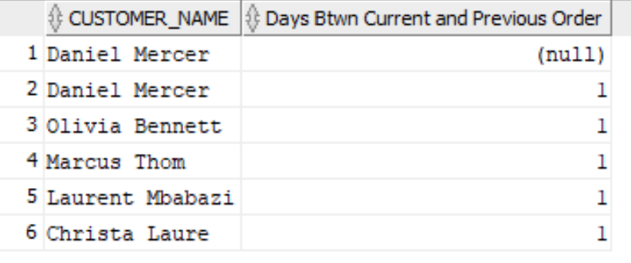

# **Challenges & Resolutions**

Management might find it difficult to run the same queries to produce reports. A user-friendly interface that hides the underlying query implementation while still providing GUI menus to interact with the database might be helpful. 

# **Conclusion**

I set up a database for Sunrise Supermarket and wrote various queries to analyze customer spending and revenue. 
